# Web Scraping Project

This project consists in scrapping the website https://books.toscrape.com/, extract all book's information and deliver it to data analysts. For that we need to build a pipeline based on Data Engineer concepts. In this project we will use Python, Airflow, Google Cloud Platform, Docker.

## Airflow setup
 1. Setting the right airflow user:  
    1. For linux users:
        ```
        echo -e "AIRFLOW_UID=$(id -u)" > .env
        ```
    2. For other operating systems users:
      
        You have to create a `.env` file in the same folder as your `docker-compose.yaml` is placed with this content:
            
            AIRFLOW_UID=50000


 2. Initialize the database:
    ```pyhon
    docker-compose up airflow-init
    ```
 3. Start all services:
    ```pyhon
    docker-compose up
    ```
Now your airflow should be running. 

3. To access the Airflow Web UI you should access your local host port 8080:

    http://localhost:8080/
    
    `Username: airflow`  
    `Password: airflow`

## Google Cloud Platform setup
For GCP we'll need to create a Service Account with specifics Roles, for that:

1. Visit your GCP dashbord:

    https://console.cloud.google.com/home/dashboard
    
2. Go to `IAM & Admin` -> `Service Account`:

    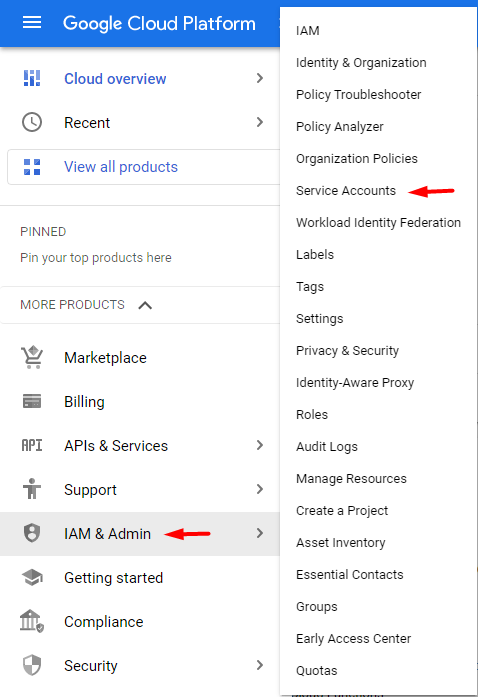
    
3. Create a new Service Account:

    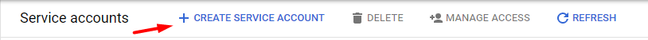

    1. Choose the Service Account display name and description (Optional)

        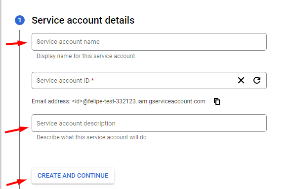 
    
    2. Include ```BigQuery Admin``` and ```Storage Admin``` roles for this Account Service

        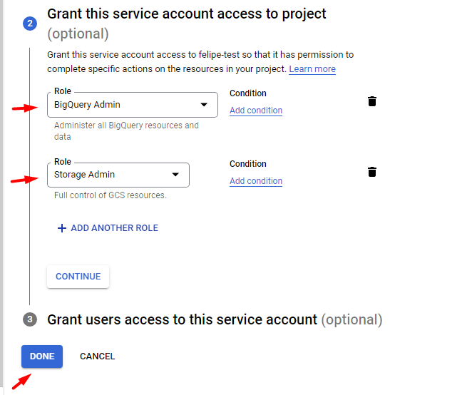
    
    3. Create JSON Key for your Service Account

        Your Service Account has been created, so now you can create a JSON key for it. To do this click in your Service Account in ```Service Account``` page then click in ```Keys``` -> ```ADD KEY``` -> ```Create new key``` -> ```JSON```
        
        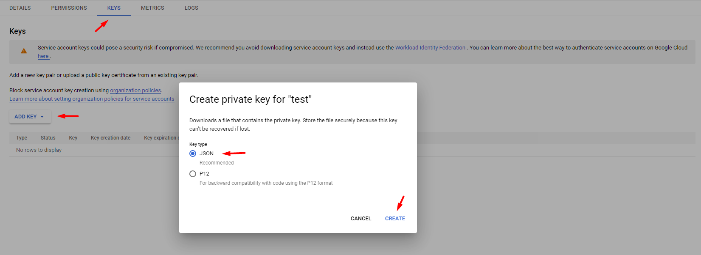
        
        It will download your json file for this Service Account. Save it because you'll need it to configure your GCP Connection in Airflow.

## Configure Airflow

1. Variable

    1. You'll need to import the variables in JSON file to your airflow. Download the file and extract the json file.
    
       file: [cayena_variables.zip](https://github.com/gomes540/cayena/files/8683926/cayena_variables.zip)
    
       Go to `Admin` -> `Variables` -> `Choose file`
    
       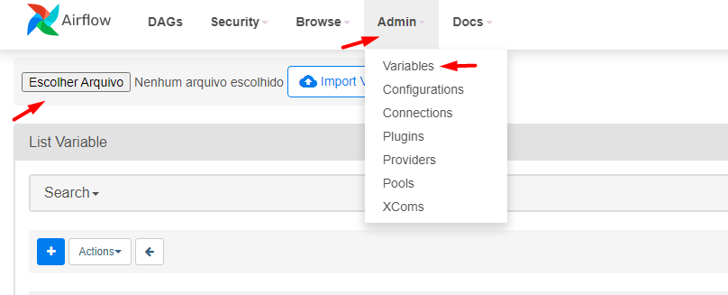
       
    2. Get your GCP project id

        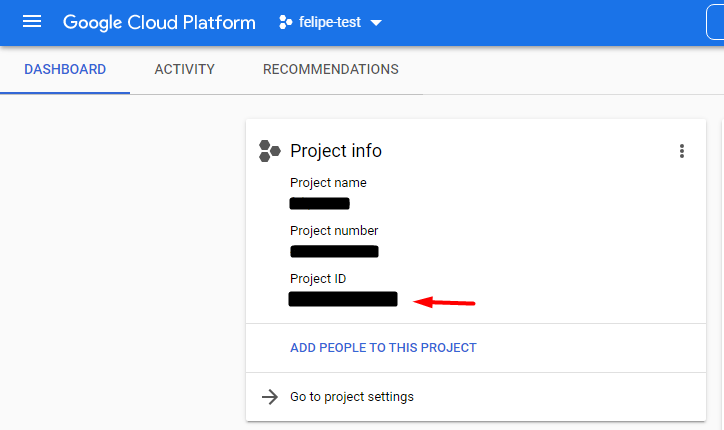

    
    2. Create a new variable called `cayena_project_id` and paste your GCP project id

        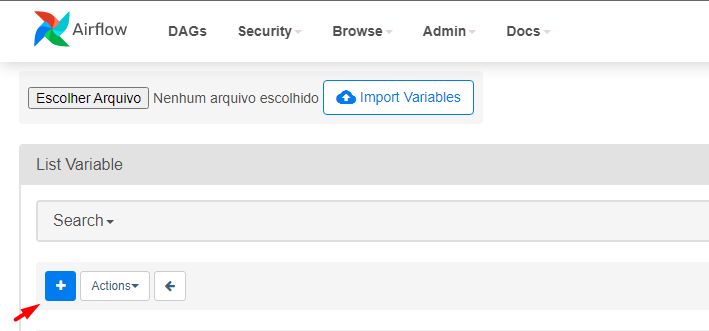
        
        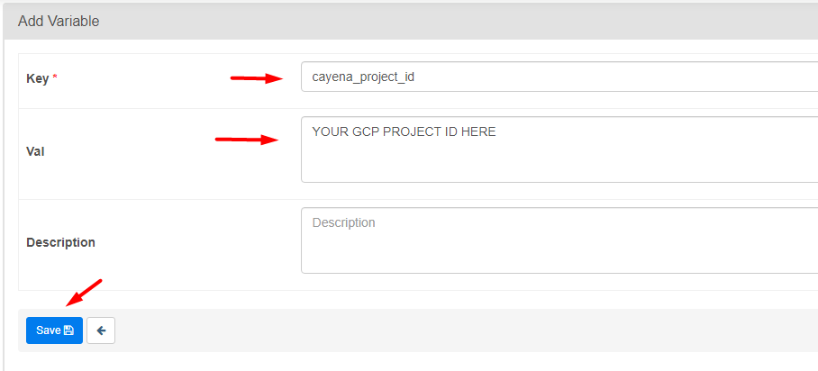


2. Connections

   1. Create a new connection for your GCP project called `gcp_cayena`

      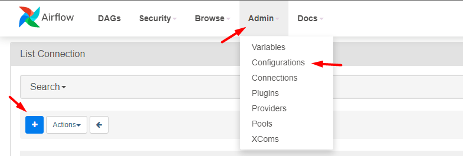
      
      Connection Configuration:
      
      `Connection Id: gcp_cayena`
      
      `Connection Type: Google Cloud`
      
      `Keyfile JSON: Your Service Account Key file`
      
      Note: Remember that you created and downloaded your Key in the step `Google Cloud Platform setup` 
      
      
      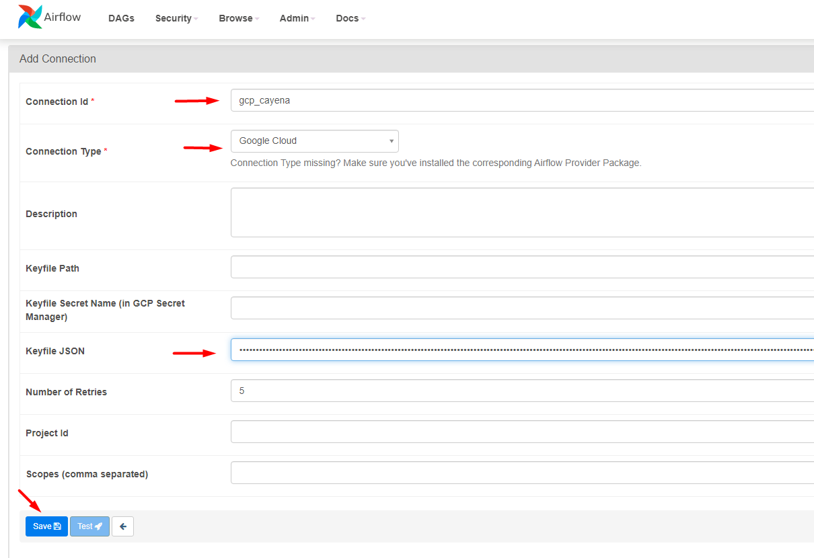
      
 
## Run the Aiflow DAG

   After all those configuration steps, now, in the Aiflow Web UI, you can see the dag. Congratulations!
   
   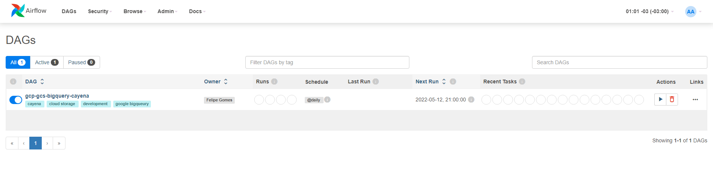
   
   Note: To run your dag, first you need to verify if your dag is unpaused
   
   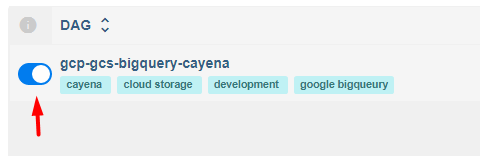

   To start your dag you can click here:
   
   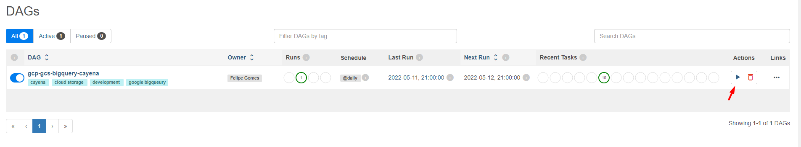


## See the results

1. Results in Airflow

   Click in the dag and you can see all tasks and if they were a success or a failure
   
   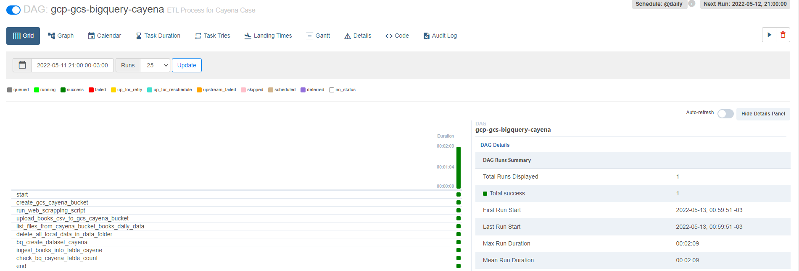
   
   Also you can see the tasks dependencies accessing the `Graph` button
   
   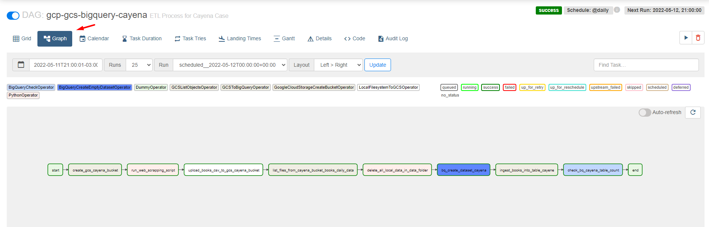
   
2. Google Cloud Platform

  1. Data Lake
     
     Accessing `Google Cloud Storage (GCS)` you'll see the bucket `cayena-bucket`
     
     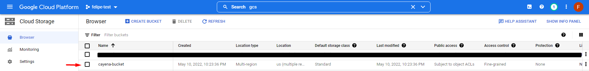
     
     Inside this bucket you can see a folder called `books-daily-data` which contains all the data extracted in the proccess
     
     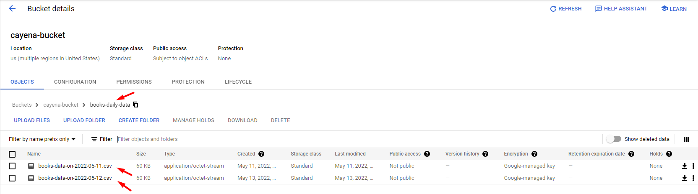
     
  2. Data Warehouse

     Accessing the `BigQuery` you can see all the data in a partitioned table called `books_history`
     
     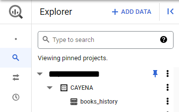
     
     Table content in a specific partition:
     
     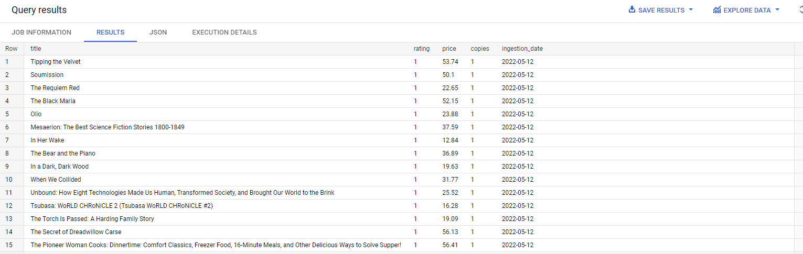
     
     
## Dashboard

   https://datastudio.google.com/reporting/c50ede6d-998f-407e-b2e2-c25c70003702


## Diagram

   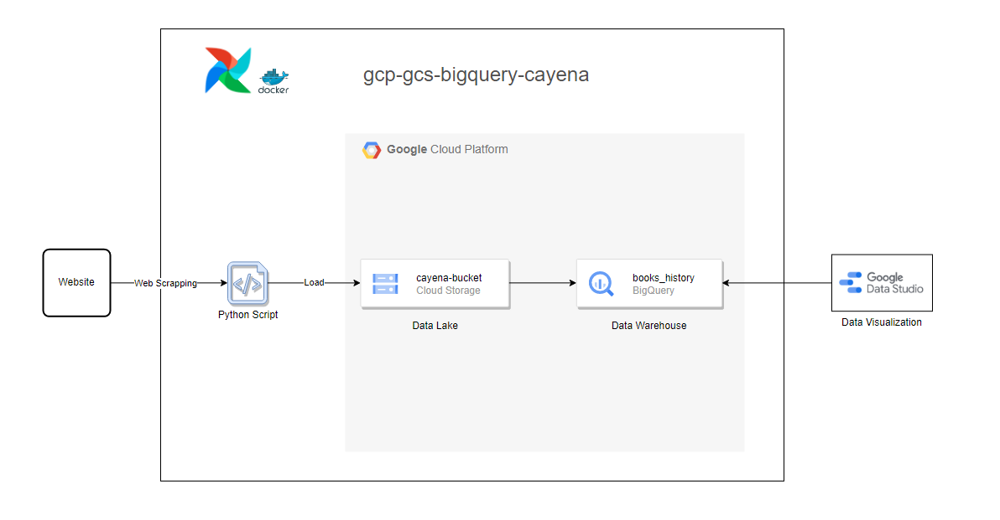
   
